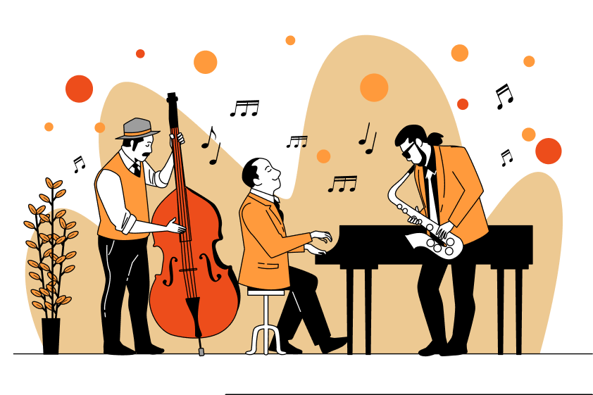

# 📑 landing page - Onebitcode

Acesse o [vídeo](https://youtu.be/Wo7UnH8TYbc?si=j5--SQUkyFVk2Rws)** e o design no [figma](https://www.figma.com/file/76GJ4uK7PyKeAo6dcpVyjA/Tom's-Jazz-School?type=design&node-id=0%3A1&mode=design&t=cJZH5vEYWR98ZB7K-1)  
 
## 🎵 Sobre:
Projeto de uma landing page de uma escola de música. 

- Linguangens ultilizadas: HTML e CSS;
- Ferramentas: Figma e Visual Studio Code.

## 💡 O que aprendi:
- conceitos de Mobile First;
- vários conceitos de boas práticas;
- como fazer uma img se adaptar a qualquer tamanho de tela;
- como nomear variáveis;

 ** algo que fiz e me ajudou foi tentar criar a página sozinha e só depois assistir os vídeos, eu já tinha em mente o que eu não tinha conseguido fazer, e consegui aproveitar muito mais o conteúdo das aulas sem codar junto, só comparando meu código e fazendo alguns ajustes. 
